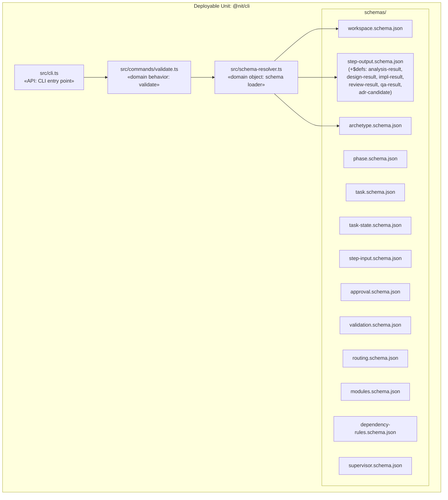

# Design — Task 1: CLI Package Foundation and JSON Schemas

<design>

  <type>devops</type>

  

    This task establishes the @nit/cli package as the home for all nit plumbing: JSON Schemas, archetypes (future tasks), hooks (future tasks), and the CLI entry point. The package is a Bun-native TypeScript project -- Bun runs TypeScript directly, so there is no compile step and no dist/ directory. The bin entry in package.json points straight to a TypeScript source file.

    The package exposes a single command at this stage: `nit validate --schema <type> <file>`. This command locates the named schema from the package's internal schemas/ directory and validates the given file against it using ajv (the library, not ajv-cli). Using ajv as a library gives full control over error formatting, exit codes, and future extensibility (e.g., custom keywords, format validators) without shelling out to a subprocess. JSON Schema 2020-12 is used for all schemas, chosen for its mature $ref/$defs support and broad tooling compatibility.

    The schemas/ directory at the package root contains all ~13 standalone .schema.json files. Embedded types (analysis-result, design-result, implementation-result, review-result, qa-result, adr-candidate) are defined as $defs within step-output.schema.json and referenced via $ref -- no separate schema files for these. Each schema is self-contained (no cross-file $ref between schema files) to keep validation simple and avoid resolution path issues.
  

  <key-decisions>
    <decision id="KD-1">
      <description>Use JSON Schema 2020-12 for all schema files</description>
      <rationale>2020-12 is the latest stable JSON Schema specification. It has the cleanest $defs/$ref model (replacing the older definitions/\$ref pattern), is fully supported by ajv (the chosen validator), and is supported by check-jsonschema for meta-schema validation of the schemas themselves. Using the latest stable version avoids adopting patterns that are deprecated in newer drafts.</rationale>
    </decision>
    <decision id="KD-2">
      <description>Use ajv as a library (not ajv-cli) for schema validation</description>
      <rationale>The CLI package is already a Bun/TypeScript project. Importing ajv as a library dependency keeps everything in-process -- no subprocess spawning, no PATH resolution issues, no separate binary to install. It also enables structured error output formatting, custom exit codes, and future extensibility (custom format validators, custom keywords) that a CLI wrapper cannot provide. ajv is the most widely used JSON Schema validator in the Node ecosystem and supports 2020-12 via the ajv/dist/2020 import.</rationale>
    </decision>
    <decision id="KD-3">
      <description>No compile step -- Bun executes TypeScript source directly</description>
      <rationale>Bun natively runs .ts files without transpilation. This eliminates the build step, removes dist/ from the package, and simplifies development. The bin entry in package.json points to src/cli.ts with a bun shebang. npx invocation also works because npx delegates to the bin entry, and if Bun is the runtime, it handles TypeScript directly. For environments without Bun, a future task can add a build step if needed -- but per the PRD, Bun is the primary runtime.</rationale>
    </decision>
    <decision id="KD-4">
      <description>Schemas are self-contained -- no cross-file $ref between schema files</description>
      <rationale>Each .schema.json file is independently validatable without needing to resolve references to other schema files. The only $ref usage is internal (within the same file, pointing to $defs in the same document). This eliminates schema resolution path complexity, makes each schema usable in isolation, and avoids the need for a custom ajv schema loader that maps $ref URIs to file paths.</rationale>
    </decision>
    <decision id="KD-5">
      <description>Embedded types live as $defs inside step-output.schema.json, not as separate schema files</description>
      <rationale>Per U-8 in CLARIFICATIONS.md, embedded types (analysis-result, design-result, implementation-result, review-result, qa-result, adr-candidate) are validated as part of step-output, not independently. Defining them as $defs within step-output.schema.json keeps them co-located with their usage, avoids inflating the schema file count, and matches the PRD's "~13 standalone schema files" expectation.</rationale>
    </decision>
    <decision id="KD-6">
      <description>schemas/ directory at the package root, not nested under src/</description>
      <rationale>Schemas are data files, not source code. Placing them at the package root (alongside src/ and package.json) makes them easy to find, reference from hooks, and validate independently with external tools. The CLI code resolves schema paths relative to the package root at runtime.</rationale>
    </decision>
  </key-decisions>

  <trade-offs>
    <trade-off id="TO-1">
      <description>ajv as a library vs. ajv-cli as a subprocess</description>
      <options>
        <option id="OPT-1" chosen="true">
          <title>ajv as a library dependency</title>
          <pros>
          - Full control over error formatting and exit codes
          - No subprocess overhead
          - Extensible (custom keywords, format validators)
          - Single dependency, no separate binary management
          </pros>
          <cons>
          - Requires writing the validation harness code (command parsing, schema loading, error formatting)
          - ajv's 2020-12 support requires importing from ajv/dist/2020 specifically
          </cons>
          <current-consequences>
          - More implementation work upfront to build the validate command
          - But the validate command is exactly what this task delivers, so the work is scoped correctly
          </current-consequences>
          <long-term-consequences>
          - Validation hooks can call `npx nit validate` and get structured error output tailored to nit's needs
          - Adding custom validation logic (e.g., cross-field rules beyond JSON Schema) is straightforward
          </long-term-consequences>
        </option>
        <option id="OPT-2" chosen="false">
          <title>ajv-cli as a subprocess</title>
          <pros>
          - Zero validation harness code -- just shell out to ajv-cli
          - Well-tested CLI interface
          </pros>
          <cons>
          - Error output format is fixed by ajv-cli, cannot customize
          - Adds a separate binary dependency that must be on PATH
          - Subprocess spawning overhead per validation call
          - Less control over exit codes and error structure
          </cons>
          <current-consequences>
          - Faster initial implementation, but less flexibility
          </current-consequences>
          <long-term-consequences>
          - Hooks that call validation would depend on ajv-cli being installed globally or resolvable via npx
          - Custom validation logic would require a second tool or wrapper
          </long-term-consequences>
        </option>
      </options>
    </trade-off>
  </trade-offs>

  <diagrams>

  </diagrams>

  <related-adrs>
    - .nit/adr/0002-json-schema-2020-12-with-ajv-library.md (created)
  </related-adrs>

</design>
