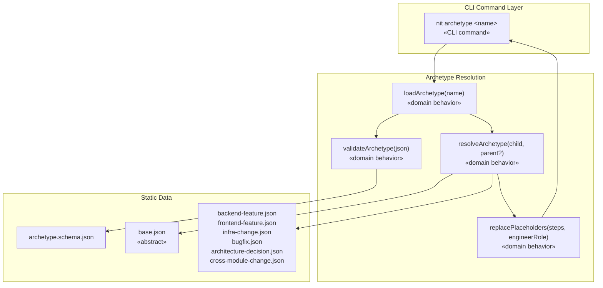

# Design — Task 10: Archetype Definitions with Inheritance

<design>

  <type>devops</type>

  

    Add 7 archetype JSON files (1 abstract base + 6 concrete) to the CLI package's `archetypes/` directory
    and implement an inheritance resolver that merges parent steps with child overrides to produce a flat
    step list. Expose this via `npx nit archetype <name>` which loads the named archetype, resolves
    inheritance, replaces `$engineer` placeholders with the archetype's `engineerRole`, and outputs
    the resolved flat step list as JSON.

    The resolver enforces two constraints: abstract archetypes cannot be used directly, and only
    single-level inheritance is allowed (a child's parent must not itself extend another archetype).
    The archetype files follow the structure defined in PRD Section 4.1.2 and validate against the
    existing `archetype.schema.json` from TASK-009.
  

  <key-decisions>
    <decision id="KD-1">
      <description>Archetypes live in cli/archetypes/ as static JSON files, co-located with schemas</description>
      <rationale>PRD Section 4.1.15 specifies archetypes are internal to the CLI package ("invisible to user"), alongside schemas and hooks. The archetypes/ directory mirrors the schemas/ directory pattern already established in TASK-009.</rationale>
    </decision>
    <decision id="KD-2">
      <description>The resolver is a pure function: load archetype JSON, resolve parent if extends is present, apply overrides, replace placeholders, return flat step array</description>
      <rationale>Keeping resolution as a pure function with no side effects makes it testable in isolation and reusable by the future supervisor (TASK-015) without coupling to the CLI command layer.</rationale>
    </decision>
    <decision id="KD-3">
      <description>Placeholder replacement is limited to $engineer → engineerRole value; $detect is preserved as-is in the output</description>
      <rationale>Per PRD: "$detect means the engineer role is determined at runtime from the module's type tag." The archetype command resolves static inheritance but does not perform runtime detection — that is the supervisor's responsibility. Preserving $detect in output signals to consumers that runtime resolution is still needed.</rationale>
    </decision>
    <decision id="KD-4">
      <description>Override operations are applied in order: removeSteps first, then step property modifications, then addSteps</description>
      <rationale>This ordering prevents conflicts: removing a step that was also modified is a no-op on the modification, and added steps are inserted into the already-pruned list. Matches the PRD's merge description: "parent steps + child overrides (add/remove/modify steps)."</rationale>
    </decision>
    <decision id="KD-5">
      <description>The archetype command validates input files against archetype.schema.json before resolution</description>
      <rationale>Catching malformed archetype files before attempting inheritance resolution produces clearer error messages and reuses the validation infrastructure from TASK-009.</rationale>
    </decision>
    <decision id="KD-6">
      <description>The resolved output is a flat step array, not a full archetype object</description>
      <rationale>The consumer of resolved archetypes (the supervisor) needs the step sequence, not the inheritance metadata. Outputting only the flat step list makes the contract clear: after resolution, inheritance is gone. The engineerRole and rejectionRouting are included as top-level metadata alongside the steps array for completeness.</rationale>
    </decision>
  </key-decisions>

  <integration-points>
    <integration id="IP-1">
      <type>internal</type>
      <target>TASK-009 CLI infrastructure (cli.ts, schema-resolver, validate command)</target>
      <exists>yes</exists>
      <communication>function-call</communication>
      <potential-issues>
      - The archetype command needs to be registered in cli.ts alongside the existing validate command
      - Schema validation reuses the ajv infrastructure from TASK-009; the archetype.schema.json must be loadable via the existing schema-resolver
      </potential-issues>
      <patterns>
      - Same command pattern as validate: a function in src/commands/archetype.ts imported by cli.ts
      - Same schema resolution pattern via resolveSchema("archetype")
      </patterns>
    </integration>
  </integration-points>

  <trade-offs>
    <trade-off id="TO-1">
      <description>Whether to validate archetype files at load time or rely on pre-validated static files</description>
      <options>
        <option id="OPT-1" chosen="true">
          <title>Validate at load time</title>
          <pros>
          - Catches corruption or manual edits immediately
          - Consistent error messages through the same validation path
          - Acts as a safety net if archetype files are modified outside the normal workflow
          </pros>
          <cons>
          - Small performance overhead loading ajv on every archetype command invocation
          </cons>
          <current-consequences>
          - Each `nit archetype` call compiles the schema and validates — negligible for a CLI tool
          </current-consequences>
          <long-term-consequences>
          - When the supervisor calls the resolver in a loop, the ajv instance should be cached (same suggestion from TASK-009 review applies here)
          </long-term-consequences>
        </option>
        <option id="OPT-2" chosen="false">
          <title>Trust static files, skip validation</title>
          <pros>
          - Faster execution, no ajv dependency at resolve time
          </pros>
          <cons>
          - Silent failures if files are malformed
          - Inconsistent with the validation-first approach established in TASK-009
          </cons>
          <current-consequences>
          - Saves a few milliseconds per invocation
          </current-consequences>
          <long-term-consequences>
          - Debugging malformed archetypes becomes harder when errors surface downstream in the supervisor
          </long-term-consequences>
        </option>
      </options>
    </trade-off>
  </trade-offs>

  <diagrams>

  </diagrams>

  <related-adrs>
    - .nit/adr/0002-json-schema-2020-12-with-ajv-library.md (referenced)
  </related-adrs>

</design>
