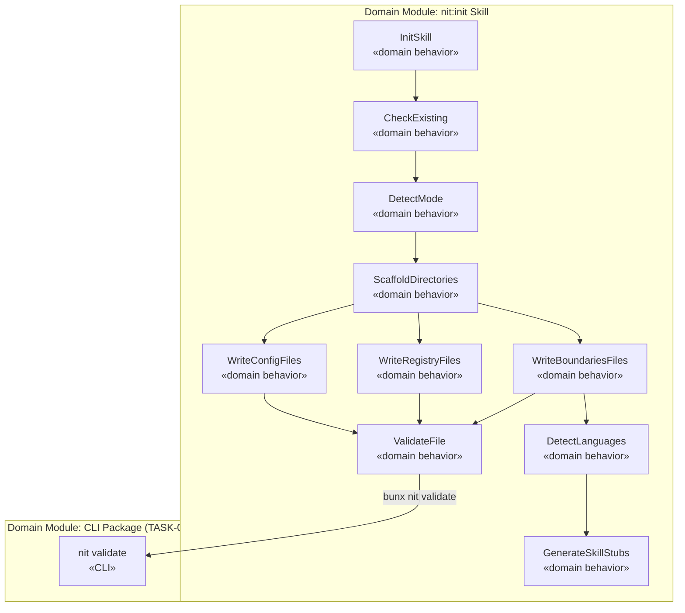

# Design — Task 11: Config and Registry Scaffolding (nit:init Rewrite)

<design>

  <type>devops</type>

  

    This design rewrites the `nit:init` skill to scaffold the complete v2 `.nit/` directory structure,
    producing all default config and registry JSON files validated against the schemas established in
    TASK-009. The skill replaces the v1 YAML-based config approach with the JSON-first v2 model and
    handles two distinct modes: greenfield (empty directories, manual module registration) and brownfield
    (existing codebase, auto-populated modules via language detection).

    The scaffolding is split into three concerns: (1) directory creation, (2) static default file
    generation for config and registry, and (3) mode-specific work (brownfield scan and language skill
    stub generation). Each generated file is validated against its schema using the ajv-based `nit validate`
    command from the CLI package before the skill reports success. If any file fails validation the skill
    stops and surfaces the schema error to the user.

    Language detection in brownfield mode inspects source file extensions in each detected directory to
    assign a `languageId` to each module entry in `boundaries/modules.json`. For each unique language
    found, the skill generates a minimal `.claude/skills/<language>/SKILL.md` stub marked as
    auto-generated, per the mitigation in R-6.
  

  <key-decisions>
    <decision id="KD-1">
      <description>
        The five config files (workspace.json, supervisor.json, validation.json, role-routing.json,
        adr-triggers.json) are written with hardcoded, schema-valid defaults. No user prompting is
        needed for these files beyond project name and mode.
      </description>
      <rationale>
        All required fields have sensible defaults established by the schema and clarifications
        (e.g., maxReopenCount=3 from U-7, mode from user selection). Prompting for every field
        would make init slow and error-prone. Users can edit files directly afterward.
      </rationale>
    </decision>

    <decision id="KD-2">
      <description>
        The four registry files (task-types.json, roles.json, skills.json, artifact-types.json) are
        written as complete, hardcoded defaults reflecting the 6 concrete archetypes, 7 roles, and
        ~20 artifact types defined in the PRD. They are not derived from the archetype JSON files at
        runtime.
      </description>
      <rationale>
        Registry files are project state, not derived artifacts. They can diverge from the installed
        archetypes as projects evolve. Generating them from archetype files at init time would couple
        project state to the installed skill version, creating the version drift problem R-3 is meant
        to address.
      </rationale>
    </decision>

    <decision id="KD-3">
      <description>
        The `boundaries/modules.json` file is always created. In greenfield mode it contains an empty
        `modules` array. In brownfield mode the skill populates it with detected modules.
      </description>
      <rationale>
        Downstream skills (supervisor, task routing) expect `boundaries/modules.json` to exist.
        An empty array is a valid schema state for greenfield. Creating the file unconditionally
        avoids defensive "does-this-file-exist" checks in all downstream consumers.
      </rationale>
    </decision>

    <decision id="KD-4">
      <description>
        Each generated file is validated against its schema using `bunx nit validate --schema <type> <file>`
        (with `npx` as the fallback per R-5) immediately after writing. If validation fails, the skill surfaces the error and halts rather
        than continuing to write remaining files.
      </description>
      <rationale>
        ADR-0002 established ajv-based schema validation as the canonical validation mechanism.
        Validating at generation time catches bugs in the skill's own default values immediately
        (e.g., a missing required field), rather than silently producing invalid state that fails
        later during supervisor startup.
      </rationale>
    </decision>

    <decision id="KD-5">
      <description>
        In brownfield mode, language detection is heuristic: inspect file extensions in each candidate
        directory subtree. The skill assigns a `languageId` to each detected module. Auto-generated
        SKILL.md stubs are written to `.claude/skills/<languageId>/SKILL.md`.
      </description>
      <rationale>
        Full static analysis (build file parsing, manifest inspection) is out of scope for init.
        Extension heuristics are sufficient to bootstrap the modules registry. Users can refine
        language assignments directly in modules.json. Per R-6, auto-generated stubs are explicitly
        marked as needing user refinement to manage quality expectations.
      </rationale>
    </decision>

    <decision id="KD-6">
      <description>
        Re-initializing an existing `.nit/` workspace requires explicit user confirmation. On
        confirmation, the skill performs a clean scaffold — v1 artifacts are not migrated per A-2.
      </description>
      <rationale>
        A-2 confirms v1 is fully replaced with no migration. The open question Q-1 in TASK.md is
        answered by this assumption. Requiring explicit confirmation prevents accidental data loss.
      </rationale>
    </decision>
  </key-decisions>

  <integration-points>
    <integration id="IP-1">
      <type>internal</type>
      <target>CLI package validate command (from TASK-009)</target>
      <exists>yes</exists>
      <communication>CLI</communication>
      <potential-issues>
      - The `nit validate` command must be reachable via `bunx nit validate` (with `npx` as the
        fallback per R-5) at the time init runs. If the CLI package is not installed or not on PATH,
        validation calls fail.
      - Schema paths inside the CLI package must be stable — any rename breaks the validate invocation.
      </potential-issues>
      <patterns>
      - Fail-fast: validate each file immediately after writing; do not batch validation to the end.
      - Skill surfaces the exact schema error from validate output to the user.
      </patterns>
    </integration>

    <integration id="IP-2">
      <type>internal</type>
      <target>Archetype files in cli/archetypes/ (from TASK-010)</target>
      <exists>yes</exists>
      <communication>file-system</communication>
      <potential-issues>
      - task-types.json is hand-authored in the skill defaults and must stay in sync with the 6
        archetype files. If a new archetype is added in a later task, task-types.json defaults would
        be stale for new projects.
      </potential-issues>
      <patterns>
      - task-types.json is treated as declarative project state, not a derived view of archetypes.
        Sync is a human responsibility documented in the skill's own comments.
      </patterns>
    </integration>

    <integration id="IP-3">
      <type>internal</type>
      <target>Brownfield orchestration skill (nit:brownfield-orchestrate)</target>
      <exists>yes</exists>
      <communication>CLI</communication>
      <potential-issues>
      - In brownfield mode the skill performs lightweight language detection itself, but full
        initial-state.md analysis requires running `nit:brownfield-orchestrate`. The skill must
        clearly communicate this boundary to avoid user confusion about what init does vs. what the
        brownfield orchestrator does.
      </potential-issues>
      <patterns>
      - Init populates modules.json with detected module names, paths, and languageIds only.
        It does NOT produce initial-state.md. After init, the skill explicitly tells the user
        to run /nit:brownfield-orchestrate for full analysis.
      </patterns>
    </integration>
  </integration-points>

  <trade-offs>
    <trade-off id="TO-1">
      <description>
        How much brownfield module detection happens in init vs. being deferred entirely to
        nit:brownfield-orchestrate.
      </description>
      <options>
        <option id="OPT-1" chosen="true">
          <title>Lightweight detection in init (extension heuristics), full analysis deferred</title>
          <pros>
          - modules.json is populated on day one, enabling task routing immediately after init
          - Language skill stubs are generated so the engineer has something to work with right away
          - Keeps init fast — no deep AST or build-file analysis
          </pros>
          <cons>
          - Heuristic detection can misidentify languages (e.g., a TypeScript project with leftover .js files)
          - modules.json may need manual correction before first task is run
          </cons>
          <current-consequences>
          - Init produces a usable but imprecise modules.json for brownfield projects
          </current-consequences>
          <long-term-consequences>
          - Users who don't run brownfield-orchestrate may work with incorrect module metadata until
            they notice routing anomalies
          </long-term-consequences>
        </option>
        <option id="OPT-2" chosen="false">
          <title>Defer all detection to nit:brownfield-orchestrate</title>
          <pros>
          - Init stays simple and uniform for both modes
          - No risk of incorrect heuristic detection
          </pros>
          <cons>
          - modules.json is empty after init in brownfield mode, breaking task routing until brownfield-orchestrate runs
          - Users can't create their first task without an extra required step
          </cons>
          <current-consequences>
          - Additional mandatory step before any task can be created
          </current-consequences>
          <long-term-consequences>
          - Worse onboarding UX; users likely to file issues about "routing not working"
          </long-term-consequences>
        </option>
      </options>
    </trade-off>
  </trade-offs>

  <diagrams>

  </diagrams>

  <related-adrs>
    - /home/lgrula/Projects/nit/.nit/adr/0002-json-schema-2020-12-with-ajv-library.md (referenced)
    - /home/lgrula/Projects/nit/.nit/adr/0003-nit-init-validates-generated-files-at-write-time.md (created)
  </related-adrs>

</design>
