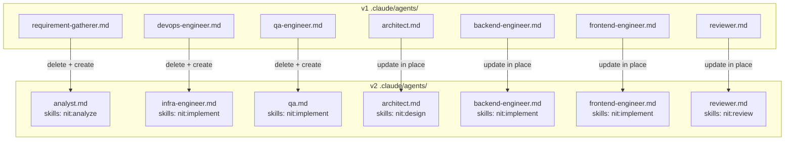

# Design — Task 12: Agent Definitions for v2 Roles

<design>

  <type>devops</type>

  

    This design updates the seven Claude Code agent definition files in `.claude/agents/` to reflect
    the v2 role model. Three v1 agents are renamed (requirement-gatherer → analyst,
    devops-engineer → infra-engineer, qa-engineer → qa); their old files are deleted. The remaining
    four (architect, backend-engineer, frontend-engineer, reviewer) are updated in place. All seven
    agents get correct v2 skill references and role-appropriate tool lists.

    The implementation is purely file-level: delete three stale files, create three new files with
    updated names, and edit four existing files to align descriptions, skill references, and tool lists.
    No runtime logic changes — agent files are static declarations consumed by the Claude Code harness.

    The analyst agent deliberately forward-references the `nit:analyze` skill (to be created in
    TASK-013). The agent definition outlives any single skill implementation; the harness will resolve
    the skill at invocation time.
  

  <key-decisions>
    <decision id="KD-1">
      <description>
        Delete three v1 agent files and create three new v2 replacements:
        - Delete `requirement-gatherer.md`, create `analyst.md`
        - Delete `devops-engineer.md`, create `infra-engineer.md`
        - Delete `qa-engineer.md`, create `qa.md`
        Update four existing files in place: architect.md, backend-engineer.md, frontend-engineer.md, reviewer.md.
      </description>
      <rationale>
        Rename-in-place (Edit) is not viable for file-level renames in Claude Code's tool set.
        Delete + create gives a clean file with the correct name, avoiding confusion with stale
        identifiers (e.g., the `name:` field in the frontmatter) and making git history clear
        about the intent.
      </rationale>
    </decision>

    <decision id="KD-2">
      <description>
        The analyst agent forward-references `nit:analyze` as its primary skill, even though the
        skill does not yet exist (will be created in TASK-013).
      </description>
      <rationale>
        Agent definition files are declarations, not executable code. The `skills:` field is a
        hint to the supervisor and to Claude reading the agent definition — it does not require
        the skill file to exist at write time. Writing the correct final skill name now avoids
        a second edit to analyst.md when TASK-013 lands.
      </rationale>
    </decision>

    <decision id="KD-3">
      <description>
        Tool lists are differentiated by role responsibility:
        - **Engineers** (backend, frontend, infra, qa): `Read, Write, Edit, Bash, Glob, Grep` — full
          set because they modify source files and run builds.
        - **Analyst**: `Read, Write, Edit, Glob, Grep` — no Bash; clarification is read/write of
          markdown/JSON only.
        - **Architect**: `Read, Write, Edit, Bash, Glob, Grep` — Bash needed for ADR numbering
          (ls .nit/adr/).
        - **Reviewer**: `Read, Write, Bash, Glob, Grep` — Write for REVIEW.md creation; no Edit
          because the reviewer must not modify implementation files; Bash for running the test suite.
      </description>
      <rationale>
        AC-3 requires tools appropriate to each role. The meaningful distinction is Edit access:
        only roles that modify source code (engineers, architect) need Edit. The reviewer reads
        code and writes one new artifact (REVIEW.md) — denying Edit signals this boundary clearly
        and prevents accidental source modification during review.
      </rationale>
    </decision>

    <decision id="KD-4">
      <description>
        All 7 agent files use the same frontmatter schema as v1:
        `name`, `description`, `allowed-tools`, `permissionMode: default`, `skills` (or `skills-used`
        comment for skills not directly referenced in the body).
      </description>
      <rationale>
        The Claude Code harness reads this schema. Deviating from it without a corresponding harness
        update would break agent invocation. v2 renames the agents but does not change the harness
        contract.
      </rationale>
    </decision>
  </key-decisions>

  <integration-points>
    <integration id="IP-1">
      <type>internal</type>
      <target>Claude Code agent invocation harness</target>
      <exists>yes</exists>
      <communication>file-system</communication>
      <potential-issues>
      - The `name:` field in frontmatter must match the filename stem for the harness to resolve agents
        correctly. Mismatches cause silent dispatch failures.
      - The `skills:` field is a hint — if the skill file doesn't exist, invocation will fail at
        runtime (not at definition time). analyst.md's forward reference to `nit:analyze` is safe until
        TASK-013 ships.
      </potential-issues>
      <patterns>
      - Each agent's `name:` matches its filename (e.g., `analyst.md` → `name: analyst`).
      - Skills listed in `skills:` use the `nit:<skill-name>` convention matching SKILL.md `name:` fields.
      </patterns>
    </integration>

    <integration id="IP-2">
      <type>internal</type>
      <target>registry/roles.json (from TASK-011)</target>
      <exists>yes</exists>
      <communication>file-system</communication>
      <potential-issues>
      - roles.json defines 7 roles with ids: analyst, architect, backend-engineer, frontend-engineer,
        infra-engineer, reviewer, qa. Agent file names must match these ids exactly.
      - Any mismatch between agent filename and roles.json id breaks supervisor task routing.
      </potential-issues>
      <patterns>
      - Agent filenames are `<role-id>.md` where role-id matches roles.json exactly.
      </patterns>
    </integration>
  </integration-points>

  <trade-offs>
    <trade-off id="TO-1">
      <description>
        Whether the analyst agent should reference `nit:clarify` + `nit:tasks` (existing skills)
        or `nit:analyze` (v2 skill, not yet created).
      </description>
      <options>
        <option id="OPT-1" chosen="true">
          <title>Forward-reference nit:analyze (v2 name, TASK-013 will create it)</title>
          <pros>
          - Agent definition reflects v2 architecture from the start
          - No second edit to analyst.md when TASK-013 lands
          - Consistent with the v2 skill naming in the task scope
          </pros>
          <cons>
          - Analyst agent is non-functional between TASK-012 and TASK-013 merging
          - Reviewer must know this gap exists
          </cons>
          <current-consequences>
          - analyst.md references a skill that doesn't exist yet; invoking the analyst agent
            fails until TASK-013 ships
          </current-consequences>
          <long-term-consequences>
          - No rework needed on analyst.md after TASK-013 — single-step transition
          </long-term-consequences>
        </option>
        <option id="OPT-2" chosen="false">
          <title>Reference existing v1 skills (nit:clarify, nit:tasks) now; update in TASK-013</title>
          <pros>
          - Analyst agent is functional immediately after TASK-012
          </pros>
          <cons>
          - Requires a second edit to analyst.md in TASK-013, spreading agent changes across two tasks
          - v1 skill names in a v2 agent definition is inconsistent
          </cons>
          <current-consequences>
          - Analyst functional with v1 skills temporarily
          </current-consequences>
          <long-term-consequences>
          - Two-task change to a single file creates review noise and potential merge conflicts
          </long-term-consequences>
        </option>
      </options>
    </trade-off>
  </trade-offs>

  <diagrams>

  </diagrams>

  <related-adrs>
    None — this task applies v2 role names from PRD section 4.1.9; no new durable decisions introduced.
  </related-adrs>

</design>
