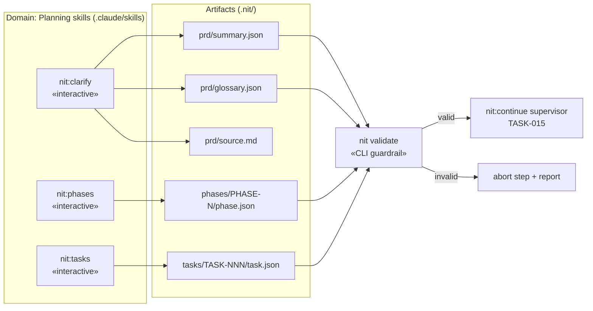

# Design — Task 13: Rewrite nit:clarify, nit:phases, nit:tasks for JSON Output

<design>

  <type>devops</type>

  

    This design rewrites three planning skills — `nit:clarify`, `nit:phases`, `nit:tasks` — so they
    persist validated JSON artifacts instead of prose Markdown, while keeping their interactive flows
    unchanged. Today these skills write human-prose files (`CLARIFICATIONS.md`, `PHASE.md`, `TASK.md`);
    v2 makes JSON the canonical, machine-readable output that the deterministic supervisor (TASK-015)
    and the skill-composition engine (TASK-014) consume without parsing Markdown.

    The interactive experience is untouched: each skill still runs its clarification Q&A or
    proposal/approval loop with the user in prose. Only the *persisted* artifact changes. After
    gathering the content, each skill writes the JSON file and immediately validates it against its
    schema in `cli/schemas/` via the CLI validator (per ADR-0003, validate-at-write-time). A schema
    violation aborts the step and reports the error, so no invalid artifact is ever persisted.

    The work is confined to the `.claude/skills` module: editing the SKILL.md instruction files for
    the three skills to add JSON-writing and validation steps. No CLI/runtime code changes. Two
    upstream gaps were discovered during design (missing PRD schemas, absent registry/module files at
    author time) and are recorded as open questions rather than designed around.
  

  <key-decisions>
    <decision id="KD-1">
      <description>
        JSON becomes the single canonical persisted artifact for planning output. `phase.json`
        replaces `PHASE.md`; `task.json` replaces the prose `TASK.md`; clarification produces
        `prd/summary.json` + `prd/glossary.json`. Human-readable views are rendered on demand by
        `nit:status`, not stored as a second Markdown copy.
      </description>
      <rationale>
        Downstream consumers (supervisor, skill composition, validation) need structured data. Keeping
        a parallel Markdown copy invites drift between the prose and the JSON and doubles the write
        surface. One source of truth, rendered for humans when needed, avoids both.
      </rationale>
    </decision>

    <decision id="KD-2">
      <description>
        Output locations follow the v2 layout: PRD artifacts under `.nit/prd/`
        (`summary.json`, `glossary.json`, `source.md` — a verbatim copy of the input PRD); phases at
        `.nit/phases/PHASE-N/phase.json`; tasks at `.nit/phases/PHASE-N/tasks/TASK-NNN/task.json`.
        Existing numbering conventions are preserved: `PHASE-N` (natural, not zero-padded) and
        `TASK-NNN` (three digits), matching what the repo already uses. The `NNN` in the acceptance
        criteria is a placeholder, not a zero-pad mandate.
      </description>
      <rationale>
        Aligns new artifacts with the directories already present, avoiding a disruptive renumber of
        the live PHASE-1/PHASE-2 tree. `.nit/prd/` groups all PRD-derived artifacts under one path the
        supervisor and clarify skill can rely on.
      </rationale>
    </decision>

    <decision id="KD-3">
      <description>
        Each skill validates every JSON file it writes against the matching schema in `cli/schemas/`
        through the `nit` CLI validator, at write time. Validation failure aborts the step and surfaces
        the schema error; the invalid file is not left behind as a committed artifact.
      </description>
      <rationale>
        Per ADR-0003 (validate generated files at write time) and ADR-0002 (JSON Schema 2020-12 via
        ajv). The supervisor treats these artifacts as trusted structured input; a hard guardrail at
        authoring time is where invalid data is cheapest to catch.
      </rationale>
    </decision>

    <decision id="KD-4">
      <description>
        Archetype proposal in `nit:tasks` is delegated to the analyst role: once task fields are
        gathered, the analyst matches the task description and the target module's type (from
        `modules.json` → `task-types.json`) to propose an archetype id, written to `task.json.archetype`
        (U-11). This is the lightweight proposal step — distinct from the `nit:analyze` step skill
        (TASK-016), which is out of scope here.
      </description>
      <rationale>
        Keeps task creation self-contained: the archetype is known and recorded before the supervisor
        ever runs, so `nit:continue` can resolve steps immediately. The proposed id must be one of the
        concrete archetypes in `cli/archetypes/` (backend-feature, frontend-feature, infra-change,
        bugfix, cross-module-change, architecture-decision).
      </rationale>
    </decision>

    <decision id="KD-5">
      <description>
        `nit:tasks` does NOT create an initial `state.json` for the task (resolves open question Q-1).
        Task-state initialization is owned by the supervisor (`nit:continue`, TASK-015) on first
        advance.
      </description>
      <rationale>
        `task.json` is a static task definition; `state.json` is mutable runtime state with a different
        owner and lifecycle. Decoupling authoring from the supervisor's state machine keeps each skill's
        responsibility clean and avoids two skills writing the same state file.
      </rationale>
    </decision>
  </key-decisions>

  <integration-points>
    <integration id="IP-1">
      <type>internal</type>
      <target>JSON Schemas in cli/schemas/ (from TASK-001)</target>
      <exists>partial</exists>
      <communication>file-system</communication>
      <potential-issues>
      - `phase.schema.json` and `task.schema.json` exist and are usable.
      - **`prd-summary.schema.json` and `glossary.schema.json` are MISSING from cli/schemas/.** AC-1
        requires `summary.json` and `glossary.json` to validate against "their schemas," which do not
        exist yet. This is a gap in TASK-001's deliverables and BLOCKS the validation clause of AC-1
        until the schemas are added (see open question Q-2).
      </potential-issues>
      <patterns>
      - Validate each artifact against its named schema before considering the step complete.
      </patterns>
    </integration>

    <integration id="IP-2">
      <type>internal</type>
      <target>Project registry and modules (task-types.json, modules.json)</target>
      <exists>no</exists>
      <communication>file-system</communication>
      <potential-issues>
      - These files are generated by v2 `nit:init` (TASK-003/TASK-011) into a project; they are absent
        in any project that has not run v2 init (including this dogfooding repo at author time).
      - `nit:tasks` must read `modules.json` to validate `targetModule` and `task-types.json` for the
        archetype default; it must fail with a clear "registry not initialised — run nit:init" message
        rather than a raw file-not-found.
      </potential-issues>
      <patterns>
      - `targetModule` must reference an existing module id in `modules.json`.
      </patterns>
    </integration>

    <integration id="IP-3">
      <type>internal</type>
      <target>nit CLI validator (bin: nit, from TASK-009)</target>
      <exists>yes</exists>
      <communication>CLI</communication>
      <potential-issues>
      - The skills invoke the validator as a subprocess; the `validate` subcommand must accept (or
        infer by artifact type) the correct schema for each file.
      </potential-issues>
      <patterns>
      - Single validation entry point reused by all three skills for consistent error reporting.
      </patterns>
    </integration>
  </integration-points>

  <trade-offs>
    <trade-off id="TO-1">
      <description>
        Whether to persist planning output as JSON only, or keep the human-prose Markdown alongside the
        JSON.
      </description>
      <options>
        <option id="OPT-1" chosen="true">
          <title>JSON only — canonical, Markdown rendered on demand by nit:status</title>
          <pros>
          - One source of truth; no MD/JSON drift
          - Downstream consumers parse structured data directly
          - Single write path per artifact
          </pros>
          <cons>
          - Raw JSON is less pleasant to read directly in a diff/editor
          - Human-readable view now depends on nit:status rendering
          </cons>
          <current-consequences>
          - Existing prose PHASE.md/TASK.md files coexist with new JSON until migrated; the pipeline
            reads JSON going forward
          </current-consequences>
          <long-term-consequences>
          - Clean machine-readable pipeline; humans rely on rendered views rather than stored prose
          </long-term-consequences>
        </option>
        <option id="OPT-2" chosen="false">
          <title>Dual output — write both Markdown and JSON</title>
          <pros>
          - Immediately readable artifacts in the repo with no tooling
          </pros>
          <cons>
          - Two representations drift; which is authoritative becomes ambiguous
          - Every skill writes twice and must keep them in sync
          </cons>
          <current-consequences>
          - More artifacts per task, more review noise
          </current-consequences>
          <long-term-consequences>
          - Sustained drift risk and doubled maintenance for every future planning-skill change
          </long-term-consequences>
        </option>
      </options>
    </trade-off>
  </trade-offs>

  <diagrams>

  </diagrams>

  <related-adrs>
    - .nit/adr/0002-json-schema-2020-12-with-ajv-library.md (referenced — validation library and dialect)
    - .nit/adr/0003-nit-init-validates-generated-files-at-write-time.md (referenced — validate-at-write-time principle applied to these skills)
  </related-adrs>

  <open-questions>
    <question id="Q-1" resolved="true">
      Should nit:tasks create an initial state.json, or does that happen when nit:continue first runs?
      RESOLVED (KD-5): nit:tasks does not; the supervisor (TASK-015) initialises state.json on first advance.
    </question>
    <question id="Q-2" resolved="false">
      prd-summary.schema.json and glossary.schema.json are absent from cli/schemas/. AC-1's validation
      clause cannot pass until they exist. Should this task add them, or is it a TASK-001 follow-up to
      close before TASK-013 implementation? (Recommend: add the two schemas as a prerequisite within
      this task, since AC-1 depends on them directly.)
    </question>
    <question id="Q-3" resolved="false">
      TASK.md out-of-scope cross-references are stale after the PHASE-2 renumber (it cites "nit:analyze
      (TASK-008)" and "state.json (TASK-007)"); nit:analyze is now TASK-016. Confirm the intended task
      ids so scope boundaries reference the correct tasks.
    </question>
  </open-questions>

</design>
