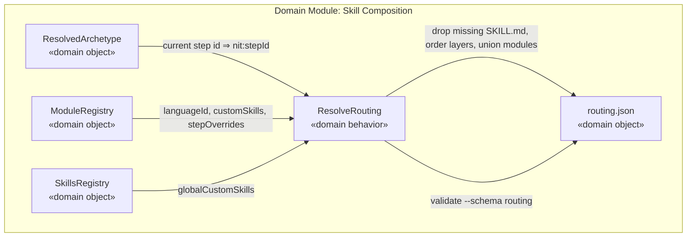
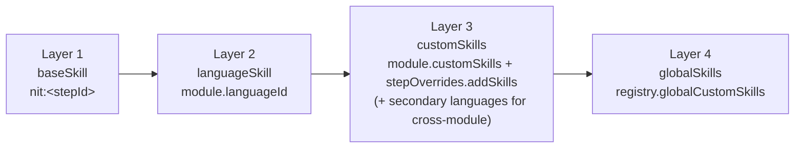

# Design — Task 14: Skill Composition Engine

<design>

  <type>devops</type>

  

    This task delivers the skill composition engine as a nit skill (prose procedure) that,
    given a task and its current step, resolves the layered skill list and persists it to the
    task's `routing.json`. Resolution follows PRD Section 9's four layers: (1) the base step
    skill derived by convention from the archetype's resolved step id, (2) the language skill
    from the target module's `languageId`, (3) custom skills from the module plus any
    step-level overrides, and (4) global custom skills from the skills registry. The engine
    reads already-existing inputs — the resolved archetype (`cli/archetypes/`), the module
    registry (`.nit/boundaries/modules.json`), and the skills registry
    (`.nit/registry/skills.json`) — and writes a single `routing.json` per task that reflects
    the current step. Every write is validated against `routing.schema.json` via the CLI.

    The base step skill is not stored on archetype steps; it is derived by the naming
    convention `nit:<stepId>` (e.g. the `implement` step ⇒ `nit:implement`). Skill *names* map
    to on-disk directories by stripping the `nit:` namespace (`nit:implement` ⇒
    `.claude/skills/implement/`; `java` ⇒ `.claude/skills/java/`). Any skill whose
    `SKILL.md` is absent is silently dropped from the resolved list so the agent still receives
    every available layer.

    This task resolves the skill list only. It does not dispatch agents, advance state, or
    expose a user-facing command — those belong to the supervisor (TASK-015) and to PHASE-3's
    `nit:resolve-routing` / `nit:explain-routing` commands respectively. The supervisor will
    invoke this composition procedure and consume the `routing.json` it produces.
  

  <key-decisions>
    <decision id="KD-1">
      <description>
        The base step skill is derived by convention as `nit:<stepId>` from the resolved
        archetype step, not stored as a field on the step. `routing.json.baseSkill` holds that
        value (e.g. `nit:implement`, `nit:review`).
      </description>
      <rationale>
        The archetype schema's step objects carry only `id`, `role`, and `approval` — there is
        deliberately no `skill` field. A single documented convention keeps archetypes lean and
        makes the base skill unambiguous for every step id without a lookup table. AC-1 and AC-2
        confirm the expected values (`nit:implement`, `nit:review`).
      </rationale>
    </decision>
    <decision id="KD-2">
      <description>
        Skill names are namespaced (`nit:` for nit's own step skills; bare names like `java`,
        `spring-boot`, `code-conventions` for language/custom/global skills). A name maps to a
        file by stripping any `nit:` prefix and resolving `.claude/skills/<name>/SKILL.md`. If
        that file does not exist, the skill is dropped from the resolved output — no error.
      </description>
      <rationale>
        PRD Section 9 requires graceful degradation (AC-4): a module may declare a `languageId`
        (e.g. `go`) before its language skill exists. Dropping missing files lets a task proceed
        with whatever layers are available rather than blocking dispatch.
      </rationale>
    </decision>
    <decision id="KD-3">
      <description>
        `routing.json` is a single per-task file that reflects the resolution for the task's
        *current* step and is regenerated (overwritten) each time the step advances. `resolvedAt`
        timestamps the resolution.
      </description>
      <rationale>
        The scope specifies one `routing.json` per task, but `baseSkill` and step-override skills
        are step-specific (AC-1 implement vs. AC-2 review). Treating the file as the current-step
        snapshot reconciles "one file per task" with per-step resolution, and matches how the
        supervisor advances one step at a time. `routing.schema.json` has no `step` field, so the
        file intentionally records only the resolved components, not the step id.
      </rationale>
    </decision>
    <decision id="KD-4">
      <description>
        Layer ordering of the effective skill list a consumer builds from `routing.json` is:
        `baseSkill` → `languageSkill` → `customSkills` (in declared order) → `globalSkills`.
        Step-override `addSkills` are appended to `customSkills` (Layer 3), after the module's
        own custom skills.
      </description>
      <rationale>
        PRD Section 9 defines the layer precedence base → language → custom → global. Placing
        step overrides within Layer 3 keeps them subordinate to the base/language layers while
        still additive, satisfying AC-2 (review step gains `security-checklist` alongside base,
        language, and module custom skills).
      </rationale>
    </decision>
    <decision id="KD-5">
      <description>
        For cross-module-change tasks, resolution unions language and custom skills across all
        target modules. The primary (first) target module's language populates `languageSkill`;
        each additional module's language skill is prepended to `customSkills` (ahead of the
        modules' custom skills), and all modules' custom skills are unioned with duplicates
        removed. Global skills are added once.
      </description>
      <rationale>
        U-3 mandates the agent receive the union of all language + custom skills from every
        target module (e.g. `nit:implement` + `java` + `typescript` + union of custom skills).
        `routing.schema.json` models a single `languageSkill` string, so representing more than
        one language requires folding the secondary languages into the `customSkills` array. The
        union is still fully present in `routing.json` (AC-3), which is what the acceptance
        criterion checks. See TO-1 for the alternative of extending the schema.
      </rationale>
    </decision>
    <decision id="KD-6">
      <description>
        Every `routing.json` is validated immediately after writing with
        `bun run ./cli/src/cli.ts validate --schema routing <path>`; a non-zero exit aborts the
        resolution rather than leaving an invalid routing file behind.
      </description>
      <rationale>
        Consistent with the project convention established in TASK-011/013 and ADR-0003
        (validate every generated JSON at write time). The `routing` schema is already
        registered in the CLI resolver.
      </rationale>
    </decision>
  </key-decisions>

  <integration-points>
    <integration id="IP-1">
      <type>internal</type>
      <target>Module registry — `.nit/boundaries/modules.json`</target>
      <exists>no</exists>
      <communication>file-system</communication>
      <potential-issues>
      - The registry is not present in this dogfooding repo; the engine must STOP with an
        actionable message ("run /nit:init") rather than a raw file-not-found.
      - `stepOverrides` is typed as an open object (`additionalProperties: true`); the engine
        reads `stepOverrides[currentStep].addSkills` defensively, treating a missing key as an
        empty list.
      </potential-issues>
      <patterns>
      - Read-only consumer of the registry; no writes back to modules.json.
      </patterns>
    </integration>
    <integration id="IP-2">
      <type>internal</type>
      <target>Skills registry — `.nit/registry/skills.json`</target>
      <exists>no</exists>
      <communication>file-system</communication>
      <potential-issues>
      - Global skills come from `globalCustomSkills[].id`. A missing registry means no global
        skills, not a failure — resolution continues with the other layers.
      </potential-issues>
      <patterns>
      - Read-only consumer.
      </patterns>
    </integration>
    <integration id="IP-3">
      <type>internal</type>
      <target>Resolved archetype definitions — `cli/archetypes/`</target>
      <exists>yes</exists>
      <communication>file-system</communication>
      <potential-issues>
      - The engine needs the *resolved* step list (base merged with child overrides) to know the
        current step id and thus `nit:<stepId>`. Archetype inheritance resolution is an existing
        capability; this task consumes its output, it does not re-implement it.
      </potential-issues>
      <patterns>
      - Consumes archetype resolution; single source of truth for step ids.
      </patterns>
    </integration>
    <integration id="IP-4">
      <type>internal</type>
      <target>Routing schema + CLI validator — `routing.schema.json`, `cli/src/cli.ts validate`</target>
      <exists>yes</exists>
      <communication>CLI</communication>
      <potential-issues>
      - `routing.schema.json` requires only `taskId` and `baseSkill`; the engine populates the
        optional fields (`targetModule`, `languageSkill`, `customSkills`, `globalSkills`,
        `resolvedAt`) and must respect `additionalProperties: false`.
      </potential-issues>
      <patterns>
      - Validate-at-write-time gate (ADR-0003).
      </patterns>
    </integration>
  </integration-points>

  <trade-offs>
    <trade-off id="TO-1">
      <description>
        How to represent multiple language skills for cross-module tasks given
        `routing.schema.json` models a single `languageSkill` string.
      </description>
      <options>
        <option id="OPT-1" chosen="true">
          <title>Fold secondary languages into customSkills (no schema change)</title>
          <pros>
          - Stays entirely within this task's module (`.claude/skills`); no change to `cli/`.
          - `routing.json` still contains the full union, satisfying AC-3 as written.
          - Zero risk to other tasks that already consume `routing.schema.json`.
          </pros>
          <cons>
          - `customSkills` becomes semantically mixed (secondary languages + true custom skills).
          - The primary/secondary language distinction is a convention, not enforced by the schema.
          </cons>
          <current-consequences>
          - The composition skill documents the ordering rule so consumers rebuild the list correctly.
          </current-consequences>
          <long-term-consequences>
          - If richer routing introspection is needed later, a first-class `languageSkills` array
            (owned by TASK-001's schema set) can supersede this convention.
          </long-term-consequences>
        </option>
        <option id="OPT-2" chosen="false">
          <title>Extend routing.schema.json with a languageSkills array / ordered skills list</title>
          <pros>
          - Models multi-language cross-module tasks first-class and unambiguously.
          - Cleaner separation between languages and custom skills.
          </pros>
          <cons>
          - Modifies `cli/schemas`, which the task scope places out of this module and TASK-001
            owns; risks other routing consumers and widens the blast radius.
          </cons>
          <current-consequences>
          - Requires a coordinated schema + validator change beyond this task's boundary.
          </current-consequences>
          <long-term-consequences>
          - Correct long-term shape, but premature here — deferred as a follow-up for TASK-001.
          </long-term-consequences>
        </option>
      </options>
    </trade-off>
  </trade-offs>

  <diagrams>

  </diagrams>

  <related-adrs>
    - .nit/adr/0003-nit-init-validates-generated-files-at-write-time.md (referenced)
  </related-adrs>

</design>
