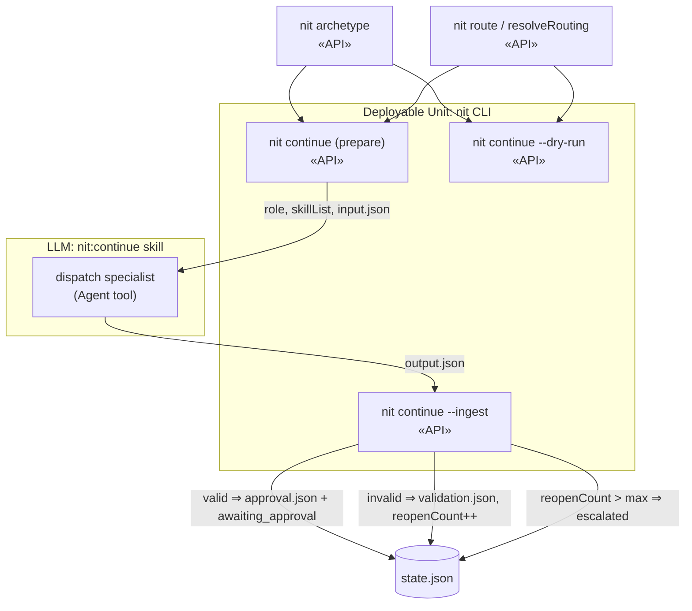
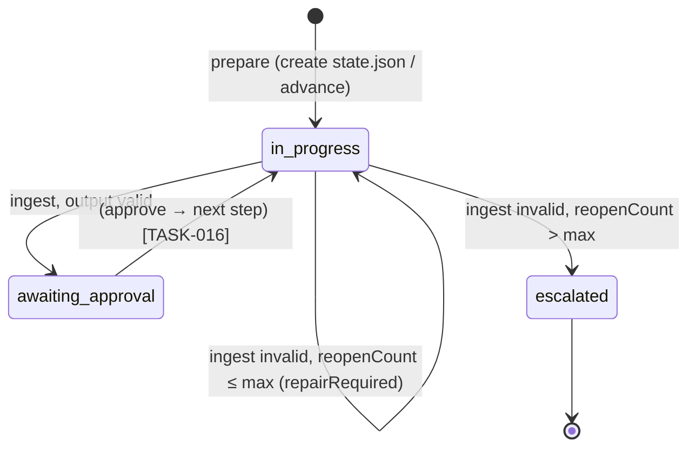

# Design — Task 15: Deterministic Supervisor (nit:continue)

<design>

  <type>devops</type>

  

    The supervisor advances a task through its archetype's resolved step sequence. Per the
    decision-maker's direction (ADR-0004, overriding clarification A-1), the deterministic logic is
    implemented as tested TypeScript in the CLI (`cli/src/supervisor.ts` + commands), and the
    `nit:continue` skill is a thin prose wrapper responsible only for the one action that must be
    LLM-driven: dispatching the specialist via the Agent tool.

    Because the Agent tool is available only to the LLM, a single step is processed in two CLI phases
    around the dispatch: a **prepare** phase computes the next step from `state.json` + the resolved
    archetype, creates the `STEP-NNN-<stepId>/` directory, regenerates `routing.json` via the TASK-014
    composition engine, writes `input.json` (including the resolved `skillList`), and moves the task to
    `in-progress`; the skill then dispatches the specialist, which writes `output.json`; an **ingest**
    phase validates `output.json` against `step-output.schema.json` and branches — on success it writes
    a pending `approval.json` and sets the task to `awaiting_approval`; on failure it writes
    `validation.json`, increments `reopenCount`, and either reopens the step with error context in a
    fresh `input.json` (`repairRequired=true`) or, once `reopenCount` exceeds `maxReopenCount`
    (from `config/supervisor.json`, default 3), sets the task to `escalated` and surfaces the
    accumulated errors. A `--dry-run` mode prints the resolved archetype, skill composition, and the
    input that would be built, writing nothing and dispatching no agent.

    All generated JSON (`state.json`, `input.json`, `approval.json`, `validation.json`) is validated
    at write time via the shared Ajv factory / `nit validate`, consistent with ADR-0003.
  

  <key-decisions>
    <decision id="KD-1">
      <description>
        The supervisor state machine is implemented as tested CLI code (`cli/src/supervisor.ts`),
        with `nit:continue` as a thin prose wrapper that only performs the Agent dispatch.
      </description>
      <rationale>
        Explicit decision-maker direction (ADR-0004) overriding A-1. Makes AC-1..AC-4 unit-testable
        and keeps the supervisor consistent with the archetype and routing engines already in the CLI.
      </rationale>
    </decision>
    <decision id="KD-2">
      <description>
        A step is processed in two CLI phases around the LLM dispatch. `nit continue` (prepare)
        computes/advances the step, scaffolds the step directory, builds `input.json`, and reports the
        dispatch descriptor (role + skillList + input path). The skill dispatches the specialist.
        `nit continue --ingest <stepDir>` validates `output.json` and performs the success/repair/
        escalate branch.
      </description>
      <rationale>
        The Agent tool is LLM-only, so the CLI cannot dispatch. Splitting at the dispatch boundary
        keeps every deterministic computation in tested code while the prose layer handles only the
        one inherently-LLM action (KD-1, ADR-0004).
      </rationale>
    </decision>
    <decision id="KD-3">
      <description>
        Extend `task-state.schema.json` `status` enum with `awaiting_approval` and `escalated`. The
        lifecycle is: (created) → `in-progress` (step prepared/dispatched) → `awaiting_approval`
        (valid output, pending approval) or, on repeated invalid output, → `escalated`. `done`/`failed`
        remain terminal.
      </description>
      <rationale>
        AC-1/AC-2 require `awaiting_approval` and AC-4 requires `escalated`, neither of which exists in
        the current enum. Extending the schema is a prerequisite for the ACs (a necessary supporting
        change, as with TASK-013's PRD schemas and TASK-014's ajv-formats).
      </rationale>
    </decision>
    <decision id="KD-4">
      <description>
        Step directories are numbered by resolved-archetype position: `STEP-<NNN>-<stepId>` where NNN
        is the 1-based index of the step in the resolved `stepOrder` (zero-padded to 3 digits).
      </description>
      <rationale>
        U-6: numbering follows the resolved step list position, so e.g. a bugfix (no analyze step)
        starts at `STEP-001-design`. `stepOrder` is captured in `state.json` on first prepare from the
        resolved archetype step list.
      </rationale>
    </decision>
    <decision id="KD-5">
      <description>
        On invalid `output.json`: write `validation.json` (a validation-result), increment
        `reopenCount`, and if `reopenCount > maxReopenCount` set `status=escalated` and report the
        accumulated errors; otherwise set `repairRequired=true`, keep `currentStepId`, and rebuild
        `input.json` for the same step with the validation errors embedded in `context`.
      </description>
      <rationale>
        U-7 / supervisor.json: bounded repair loop with escalation. `maxReopenCount` is read from
        `config/supervisor.json`, defaulting to 3 when the file is absent (dogfooding repo has no
        supervisor.json yet).
      </rationale>
    </decision>
    <decision id="KD-6">
      <description>
        The supervisor owns creation of both `state.json` (first prepare) and `routing.json`
        (regenerated each prepare via the TASK-014 composition engine). `nit:tasks` does not
        pre-create either. This resolves open question Q-1.
      </description>
      <rationale>
        `routing.json` is a current-step snapshot (TASK-014 KD-3); only the supervisor knows the
        current step, so it must regenerate routing per prepare. Keeping both files supervisor-owned
        avoids stale routing written by an earlier stage.
      </rationale>
    </decision>
    <decision id="KD-7">
      <description>
        `nit continue --dry-run` computes and prints the resolved archetype (flat step list), the skill
        composition (from a resolved `routing.json` computed in-memory), and the `input.json` that
        would be built for the next step — writing no files, creating no step directory, and
        dispatching no agent.
      </description>
      <rationale>
        AC-5. Dry-run reuses the same prepare computation with all side effects suppressed, so what it
        prints is exactly what a real run would produce.
      </rationale>
    </decision>
    <decision id="KD-8">
      <description>
        `input.json` conforms to `step-input.schema.json` (taskId, stepId, stepType, role, skillList,
        context). `context` carries the task/design references the specialist needs and, on a reopen,
        the prior validation errors. `output.json` is authored by the specialist and validated against
        `step-output.schema.json`; `approval.json` and `validation.json` conform to their existing
        schemas.
      </description>
      <rationale>
        Reuse the existing artifact schemas (U-8 embedded types via step-output $defs) rather than
        inventing new shapes; every write is schema-validated (ADR-0003).
      </rationale>
    </decision>
  </key-decisions>

  <integration-points>
    <integration id="IP-1">
      <type>internal</type>
      <target>Archetype resolver — `nit archetype <name>` / archetype-resolver.ts</target>
      <exists>yes</exists>
      <communication>function-call</communication>
      <potential-issues>
      - The resolved step list drives `stepOrder`, numbering, roles, and the approval flags per step.
        `$engineer`/`$detect` placeholders must already be resolved by the archetype resolver.
      </potential-issues>
      <patterns>
      - Consume the resolved archetype as the single source of truth for the step sequence.
      </patterns>
    </integration>
    <integration id="IP-2">
      <type>internal</type>
      <target>Skill composition engine — `nit route` / routing-resolver.ts (TASK-014)</target>
      <exists>yes</exists>
      <communication>function-call</communication>
      <potential-issues>
      - The prepare phase regenerates `routing.json` for the current step; the resulting ordered skill
        list populates `input.json.skillList` and the dispatch descriptor.
      </potential-issues>
      <patterns>
      - Reuse resolveRouting/orderedSkillList directly in-process rather than shelling out.
      </patterns>
    </integration>
    <integration id="IP-3">
      <type>internal</type>
      <target>Validator — `nit validate` / shared createAjv (TASK-014)</target>
      <exists>yes</exists>
      <communication>function-call</communication>
      <potential-issues>
      - `output.json` is validated against `step-output.schema.json`; the pass/fail drives the
        success vs repair/escalate branch. Ajv errors map into the validation-result `errors` array.
      </potential-issues>
      <patterns>
      - Validate-at-write for supervisor-authored JSON; validate-on-ingest for specialist output.
      </patterns>
    </integration>
    <integration id="IP-4">
      <type>internal</type>
      <target>Supervisor config — `config/supervisor.json`</target>
      <exists>no</exists>
      <communication>file-system</communication>
      <potential-issues>
      - Absent in the dogfooding repo; `maxReopenCount` defaults to 3 when the file or field is missing.
      </potential-issues>
      <patterns>
      - Read-only config consumer with a safe default.
      </patterns>
    </integration>
    <integration id="IP-5">
      <type>internal</type>
      <target>Specialist agents via the Agent tool (analyst, architect, engineers, reviewer, qa)</target>
      <exists>yes</exists>
      <communication>function-call</communication>
      <potential-issues>
      - LLM-only seam (KD-2). The skill passes role + skillList + input.json path in the Agent prompt
        (U-1); the agent reads the referenced SKILL.md files and writes output.json. Not unit-testable;
        verified by inspection and dogfooding.
      </potential-issues>
      <patterns>
      - Prompt-based dynamic skill loading per U-1; no agent-file rewriting.
      </patterns>
    </integration>
  </integration-points>

  <trade-offs>
    <trade-off id="TO-1">
      <description>Where to place the CLI/LLM seam for specialist dispatch.</description>
      <options>
        <option id="OPT-1" chosen="true">
          <title>Two CLI phases (prepare / ingest) around an LLM dispatch</title>
          <pros>
          - Every deterministic computation stays in tested code.
          - The prose layer shrinks to a single, well-defined action.
          </pros>
          <cons>
          - The skill must sequence two CLI calls around the dispatch and pass the step directory
            between them.
          </cons>
          <current-consequences>
          - `nit continue` (prepare) and `nit continue --ingest` are distinct invocations.
          </current-consequences>
          <long-term-consequences>
          - Clean seam that TASK-016 (approve/reject) and nit:status build on without re-deriving state.
          </long-term-consequences>
        </option>
        <option id="OPT-2" chosen="false">
          <title>Single prose-driven flow calling CLI only for validation</title>
          <pros>
          - Fewer command surfaces.
          </pros>
          <cons>
          - Moves state-transition logic back into prose, contradicting KD-1/ADR-0004 and losing
            testability.
          </cons>
          <current-consequences>
          - AC-1..AC-4 become manual-walkthrough only.
          </current-consequences>
          <long-term-consequences>
          - Inconsistent state progression as the machine grows.
          </long-term-consequences>
        </option>
      </options>
    </trade-off>
  </trade-offs>

  <diagrams>

  </diagrams>

  <related-adrs>
    - .nit/adr/0004-supervisor-state-machine-as-tested-cli-code.md (created)
    - .nit/adr/0003-nit-init-validates-generated-files-at-write-time.md (referenced)
  </related-adrs>

</design>
