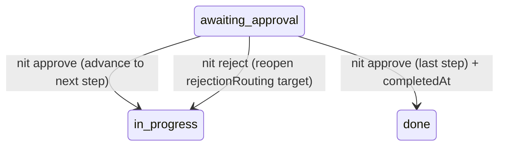

# Design — Task 16: nit:approve, nit:reject, and nit:analyze

<design>

  <type>devops</type>

  

    This task closes the approval loop the supervisor (TASK-015) opened and adds the analyze step
    skill. Following ADR-0004, the two approval operations are deterministic state transitions
    implemented as tested CLI commands (`nit approve`, `nit reject`) with thin `nit:approve` /
    `nit:reject` skill wrappers; `nit:analyze` is a prose step skill for the analyst role (like
    nit:design / nit:implement), not code.

    `nit approve` writes `approval.json` (status=approved, approvedBy, timestamp, comment) to the
    current step directory, then advances `state.json` to the next step via the existing
    `advanceState` — at the last step the task becomes terminal (status `done` + completedAt).
    `nit reject` writes `approval.json` (status=rejected, comment), reads the resolved archetype's
    `rejectionRouting`, and reopens the routed target step (e.g. reject at `review` → reopen
    `implement`), setting `currentStepId` to the target and status to `in-progress`. Both operate on
    the current active step (the step at `state.currentStepId`, which must be `awaiting_approval`),
    resolving open question Q-1. Every written JSON is validated at write time.

    `nit:analyze` instructs the analyst to read the task and project context and emit an
    `analysis-result` `output.json` (requirements findings, risks, recommendations, and a proposed
    archetype per U-11) conforming to `step-output.schema.json`. To carry the archetype proposal, the
    `analysis-result` `$def` gains an optional `proposedArchetype` field.
  

  <key-decisions>
    <decision id="KD-1">
      <description>
        `nit approve` and `nit reject` are tested CLI commands (state transitions) with thin
        `nit:approve` / `nit:reject` skill wrappers; they operate on the current active step from
        `state.json` (Q-1), requiring it to be `awaiting_approval`.
      </description>
      <rationale>
        Consistent with ADR-0004 (deterministic logic as tested CLI code) and TASK-015. Operating on
        the current step keeps the UX simple (no step-id argument) and matches how the supervisor
        parks a step at `awaiting_approval`. Q-1 is resolved in favour of current-step-by-default.
      </rationale>
    </decision>
    <decision id="KD-2">
      <description>
        `approve` reuses `advanceState` (TASK-015) to move `currentStepId` to the next step after
        writing approval.json. At the last step, `advanceState` yields the terminal state
        (status `done` + completedAt).
      </description>
      <rationale>
        AC-1 requires approve to advance the pointer; AC-3 requires a terminal completed state.
        Reusing `advanceState` guarantees identical advancement semantics to the supervisor. AC-3's
        word "completed" maps to the schema's existing terminal status `done` (vocabulary
        reconciliation — no new enum value, avoiding two terminal states).
      </rationale>
    </decision>
    <decision id="KD-3">
      <description>
        `reject` reads `rejectionRouting[currentStepId]` from the resolved archetype and sets
        `currentStepId` to the routed target with status `in-progress` and `repairRequired=false`,
        writing a rejection `approval.json` first. The target's prior step directory is reused; its
        input.json is refreshed with rejection context on the next supervisor prepare.
      </description>
      <rationale>
        PRD Section 11 / AC-2: reject at `review` routes to `implement` per the base archetype's
        `rejectionRouting`. Reading routing from the resolved archetype keeps behaviour archetype-driven.
      </rationale>
    </decision>
    <decision id="KD-4">
      <description>
        `nit:analyze` is a prose step skill (analyst role, base skill `nit:analyze`) that produces an
        `analysis-result` embedded in the step `output.json`: findings (requirements analysis), risks,
        recommendations, and a proposed archetype.
      </description>
      <rationale>
        The analyze step is specialist work (LLM), matching the nit:design / nit:implement pattern.
        `baseSkillForStep("analyze")` is already `nit:analyze` (TASK-014) and the supervisor dispatches
        it (TASK-015); this task supplies the skill's content.
      </rationale>
    </decision>
    <decision id="KD-5">
      <description>
        Extend the `analysis-result` `$def` in `step-output.schema.json` with an optional
        `proposedArchetype` string.
      </description>
      <rationale>
        AC-4 requires the analyze output to carry a proposed archetype (U-11), and the current
        `analysis-result` shape has nowhere to put it. Optional keeps existing analysis outputs valid.
      </rationale>
    </decision>
    <decision id="KD-6">
      <description>
        The supervisor's `prepare` "awaiting_approval + approved → advance" branch (TASK-015) becomes
        redundant once `approve` advances the pointer itself; it is left in place as a harmless
        fallback rather than removed in this task.
      </description>
      <rationale>
        Avoids modifying the just-merged supervisor beyond this task's scope. After `approve` advances
        to the next step (status in-progress), the next `nit:continue` prepare takes its resume/start
        path and scaffolds the step. Noted as minor tech debt for a later simplification.
      </rationale>
    </decision>
  </key-decisions>

  <integration-points>
    <integration id="IP-1">
      <type>internal</type>
      <target>Supervisor state — `state.json`, `advanceState`, `stepDirName` (TASK-015)</target>
      <exists>yes</exists>
      <communication>function-call</communication>
      <potential-issues>
      - approve/reject must read the current step directory via the same `stepDirName` numbering the
        supervisor uses, and require status `awaiting_approval` (else abort with a clear message).
      </potential-issues>
      <patterns>
      - Reuse the supervisor's pure state functions; do not duplicate transition logic.
      </patterns>
    </integration>
    <integration id="IP-2">
      <type>internal</type>
      <target>Archetype resolver — rejectionRouting (TASK-012/002)</target>
      <exists>yes</exists>
      <communication>function-call</communication>
      <potential-issues>
      - `rejectionRouting` must contain an entry for the current step; a self-route (e.g. design→design)
        reopens the same step.
      </potential-issues>
      <patterns>
      - Archetype-driven rejection targets, no hardcoded routing.
      </patterns>
    </integration>
    <integration id="IP-3">
      <type>internal</type>
      <target>Schemas + validator — approval, task-state, step-output (analysis-result)</target>
      <exists>yes</exists>
      <communication>function-call</communication>
      <potential-issues>
      - approval.json and the updated state.json are validated at write time; the extended
        analysis-result must remain backward compatible (proposedArchetype optional).
      </potential-issues>
      <patterns>
      - Validate-at-write for approval/state; additive-only schema change for analysis-result.
      </patterns>
    </integration>
  </integration-points>

  <trade-offs>
    <trade-off id="TO-1">
      <description>Whether `nit approve` advances the state pointer, or only marks approval and lets
        the supervisor's prepare advance.</description>
      <options>
        <option id="OPT-1" chosen="true">
          <title>approve advances the pointer (AC-1 literal)</title>
          <pros>
          - Matches AC-1/AC-3 exactly; approving immediately readies the next step.
          </pros>
          <cons>
          - Makes the supervisor's advance-on-approved branch redundant (KD-6).
          </cons>
          <current-consequences>
          - Two code paths could advance, but only approve's fires in practice.
          </current-consequences>
          <long-term-consequences>
          - A later cleanup can remove the redundant supervisor branch.
          </long-term-consequences>
        </option>
        <option id="OPT-2" chosen="false">
          <title>approve only marks approval; prepare advances</title>
          <pros>
          - Single advancement owner (the supervisor).
          </pros>
          <cons>
          - Contradicts AC-1 ("state.json advances currentStepId") and AC-3's terminal transition.
          </cons>
          <current-consequences>
          - Would require rewording the ACs.
          </current-consequences>
          <long-term-consequences>
          - Cleaner ownership but not what this task specifies.
          </long-term-consequences>
        </option>
      </options>
    </trade-off>
  </trade-offs>

  <diagrams>

  </diagrams>

  <related-adrs>
    - .nit/adr/0004-supervisor-state-machine-as-tested-cli-code.md (referenced)
    - .nit/adr/0003-nit-init-validates-generated-files-at-write-time.md (referenced)
  </related-adrs>

</design>
