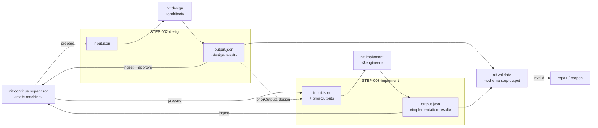

# Design — Task 17: Rewrite nit:design and nit:implement for JSON Output

<design>

  <type>devops</type>

  

    This design rewrites the two remaining PHASE-2 step skills — `nit:design` and `nit:implement` — so
    they behave like `nit:analyze` (TASK-016): dispatched by the supervisor, reading `input.json` from
    their step directory and writing a single schema-validated `output.json` back into it. Today both
    are v1 user-invoked skills (`/nit:design <phase> <task>`) that validate arguments through a
    PreToolUse hook, parse prose `TASK.md`/`DESIGN.md`, and emit prose artifacts (`DESIGN.md`,
    `STEPS.md`, `IMPLEMENTATION.md`). After this task the pipeline's first three steps — analyze,
    design, implement — are uniformly machine-readable, and only review and qa remain on the v1 shape
    (PHASE-3).

    Three gaps stand between the current state and the acceptance criteria, and this design closes all
    three. First, `step-output.schema.json` has no home for "component design" (AC-1) or
    "implementation notes" (AC-2), so the schema gains a small set of *optional, additive* fields on
    `design-result` and `implementation-result` — the same additive-schema move TASK-016 made. Second,
    the supervisor's `defaultContext` threads only `taskId`, `stepId`, and `repairErrors` into
    `input.json`, so a specialist at the implement step has no pointer to the design step's output;
    AC-3 needs one, so `defaultContext` gains a `priorOutputs` map of completed steps to their
    `output.json` paths. Third, both skills carry v1 arg-validation hooks that are meaningless under
    supervisor dispatch; the hook wiring is removed and precondition checking moves to the supervisor's
    existing input/output validation.

    The bulk of the work is in the task's module, `.claude/skills`: both `SKILL.md` files are rewritten
    to the short `nit:analyze` shape (inputs, procedure, output shape, rules) instead of the current
    290-line and 248-line prose-templating documents. The supporting `cli/` changes — two additive
    schema field groups and the `priorOutputs` context — are deterministic logic and belong in tested
    CLI code per ADR-0004, not in skill prose.
  

  <key-decisions>

    <decision id="KD-1">
      <description>
        Both skills become supervisor-dispatched step skills: they read `input.json` from
        `STEP-NNN-design/` or `STEP-NNN-implement/` and write `output.json` into the same directory as
        their sole canonical artifact. `DESIGN.md`, `STEPS.md`, and `IMPLEMENTATION.md` are no longer
        written. Any other file a step produces (source files, an ADR, a scratch note) is recorded by
        path in `output.artifacts[]`.
      </description>
      <rationale>
        Codified as ADR-0005. One validated artifact per step is what the supervisor ingests, what the
        approval flow keys off, and what the next step reads; a parallel prose copy would drift. This
        extends TASK-013's KD-1 (JSON canonical for planning artifacts) to step artifacts and follows
        the `nit:analyze` precedent set in TASK-016.
      </rationale>
    </decision>

    <decision id="KD-2">
      <description>
        `step-output.schema.json` gains optional additive fields, with no change to any `required`
        list and no removal or retyping of existing fields:
        `design-result` gains `components` (named units with responsibility and collaborators),
        `interfaces` (contract descriptions), and `filePlan` (intended path plus action);
        `implementation-result` gains `notes` (free-text implementation notes) and `tests`
        (command, outcome, and counts for the test run).
      </description>
      <rationale>
        AC-1 requires the design result to carry "component design" and AC-2 requires "implementation
        notes"; neither has a field today, and the alternative — smuggling them into `summary` prose or
        relying on the `$defs` being open by default — makes the data unschema'd and unvalidatable,
        which defeats the point of the rewrite. Additive optional fields keep every artifact already
        written by `nit:analyze` and by the supervisor's tests valid. The `resultType` const on each
        `$def` keeps the root `oneOf` unambiguous as the branches grow.
      </rationale>
    </decision>

    <decision id="KD-3">
      <description>
        The supervisor's `defaultContext` gains `priorOutputs`: a map from completed step id to the
        repo-relative path of that step's `output.json`, populated from the archetype's step list up to
        the current index, including only files that exist. Skills read prior results through this map
        rather than globbing sibling directories.
      </description>
      <rationale>
        AC-3 requires `nit:implement` to load the design step's output, and today nothing tells it
        where that is. Resolving step directory names is deterministic path logic — `stepDirName` already
        lives in the supervisor — so per ADR-0004 it belongs in tested CLI code, not in a skill
        instruction that re-derives the `STEP-NNN-<id>` convention by hand. Making it a map keyed by
        step id also serves the PHASE-3 review and qa steps, which need several prior outputs, without
        another change. As a fallback the skills document the directory convention, so a specialist is
        not dead in the water if `priorOutputs` is absent from an older `input.json`.
      </rationale>
    </decision>

    <decision id="KD-4">
      <description>
        The `hooks:` PreToolUse frontmatter is removed from both skills. `validate-design.sh` and
        `validate-implement.sh` become orphaned; they are left on disk for a dedicated cleanup once
        `nit:review` is rewritten in PHASE-3, and are flagged here so the review step does not read the
        removal as an accident.
      </description>
      <rationale>
        Those hooks validate `<phase> <task>` CLI arguments and prose `TASK.md`/`DESIGN.md` structure —
        preconditions that no longer exist under supervisor dispatch, where the input contract is
        `input.json` validated against `step-input.schema.json` and the output contract is enforced by
        the supervisor's `ingest`. `nit:analyze` already ships hookless. Deleting the scripts now would
        touch the same hook directory that the still-v1 `nit:review` depends on, so the sweep is better
        done once.
      </rationale>
    </decision>

    <decision id="KD-5">
      <description>
        Both skills emit `adrCandidates` (AC-4) rather than writing ADR files themselves: a candidate
        carries `title`, `context`, `decision`, and `status: "proposed"`. Promotion of a candidate to a
        numbered file in `.nit/adr/` stays a human/approval-gated action.
      </description>
      <rationale>
        The `adr-candidate` `$def` already exists for exactly this. Keeping ADR numbering out of the
        specialist avoids two concurrently dispatched steps racing for the next number, and keeps a
        durable, hard-to-reverse decision behind the approval gate the design step already has.
      </rationale>
    </decision>

    <decision id="KD-6">
      <description>
        Both skills validate `output.json` at write time by invoking the CLI validator
        (`validate --schema step-output <path>`) and treat a non-zero exit as a failure to fix before
        finishing, rather than relying solely on the supervisor's later `ingest`.
      </description>
      <rationale>
        ADR-0003's validate-at-write-time principle. The supervisor does re-validate on ingest, but
        catching a malformed result inside the step — while the specialist still holds the context that
        produced it — costs one retry instead of a full reopen cycle against `repairErrors`.
      </rationale>
    </decision>

  </key-decisions>

  <integration-points>

    <integration id="IP-1">
      <type>internal</type>
      <target>step-output.schema.json (cli/schemas, from TASK-001)</target>
      <exists>yes</exists>
      <communication>file-system</communication>
      <potential-issues>
      - `design-result` and `implementation-result` exist but are thinner than the acceptance criteria
        assume; see KD-2 for the additive fields.
      - The schema sets `additionalProperties: false` at the root only; the `$defs` are open. Extra
        result fields would therefore validate today *without* being schema-described — a false green.
        The additive fields must be declared, not assumed.
      - The root `result` uses `oneOf`; every `$def` must keep its `resultType` const so exactly one
        branch can ever match.
      </potential-issues>
      <patterns>
      - Additive-only schema evolution: new optional fields, never a new `required` entry on an
        existing result type.
      </patterns>
    </integration>

    <integration id="IP-2">
      <type>internal</type>
      <target>Supervisor context building (cli/src/supervisor.ts, from TASK-015)</target>
      <exists>yes</exists>
      <communication>function-call</communication>
      <potential-issues>
      - `defaultContext` currently emits only `taskId`, `stepId`, and `repairErrors`; AC-3 has no data
        path without KD-3.
      - `buildContext` is injectable via `SupervisorOptions`; the extension must go into the default
        implementation so dispatch gets it without every caller opting in.
      - `step-input.schema.json` sets `context.additionalProperties: true`, so `priorOutputs` needs no
        schema change — but the skills should tolerate its absence.
      </potential-issues>
      <patterns>
      - Deterministic path resolution stays in the CLI (ADR-0004); skills consume resolved paths.
      </patterns>
    </integration>

    <integration id="IP-3">
      <type>internal</type>
      <target>nit CLI validator (validate --schema step-output)</target>
      <exists>yes</exists>
      <communication>CLI</communication>
      <potential-issues>
      - Invoked as a subprocess from within the skill; a non-zero exit must abort the step rather than
        be reported as success.
      </potential-issues>
      <patterns>
      - Single validation entry point shared with `nit:analyze`, for identical error reporting across
        step skills.
      </patterns>
    </integration>

    <integration id="IP-4">
      <type>internal</type>
      <target>Archetype step definitions (cli/archetypes/base.json)</target>
      <exists>yes</exists>
      <communication>file-system</communication>
      <potential-issues>
      - Step ids are fixed as `design` (index 1) and `implement` (index 2), yielding
        `STEP-002-design/` and `STEP-003-implement/` under `base`. The skills must not hardcode those
        indices — archetypes may reorder or omit steps — which is a second reason to take paths from
        `priorOutputs` rather than reconstructing them.
      - The implement step's role is `$engineer`, resolved per archetype, so one skill serves the
        backend, frontend, infra, and qa engineers; it must stay engineer-type-neutral.
      </potential-issues>
      <patterns>
      - Archetype-driven step resolution; no step index literals in skill prose.
      </patterns>
    </integration>

  </integration-points>

  <trade-offs>

    <trade-off id="TO-1">
      <description>
        How `nit:implement` obtains the design step's output for AC-3: supervisor-supplied paths versus
        skill-side directory discovery.
      </description>
      <options>
        <option id="OPT-1" chosen="true">
          <title>Supervisor threads priorOutputs into input.json context</title>
          <pros>
          - Path resolution is deterministic CLI code with tests, per ADR-0004
          - The `STEP-NNN-<id>` convention stays in one place, next to `stepDirName`
          - Reusable by the PHASE-3 review and qa steps with no further change
          - `input.json` becomes self-describing: everything the specialist needs is in its input
          </pros>
          <cons>
          - Touches `cli/` in a task whose module is `.claude/skills`
          - Slightly enlarges every step's `input.json`
          </cons>
          <current-consequences>
          - One small, tested supervisor change lands alongside the two skill rewrites
          </current-consequences>
          <long-term-consequences>
          - Prior-step access is a solved, uniform problem for every future step type
          </long-term-consequences>
        </option>
        <option id="OPT-2" chosen="false">
          <title>Skill globs sibling STEP-*-design/output.json</title>
          <pros>
          - Confines the change to `.claude/skills`; no CLI edit
          </pros>
          <cons>
          - Re-encodes the directory convention in skill prose, where it cannot be tested and will
            drift from `stepDirName`
          - Ambiguous when a step has been reopened or a convention changes
          - Every future step skill repeats the same glob instructions
          </cons>
          <current-consequences>
          - Smaller diff now, with untested path logic expressed in natural language
          </current-consequences>
          <long-term-consequences>
          - The convention is duplicated across four or more skills and breaks silently when it moves
          </long-term-consequences>
        </option>
      </options>
    </trade-off>

    <trade-off id="TO-2">
      <description>
        Where "component design", "interface contracts", "file plan", and "implementation notes" live,
        given the current schema has no fields for them.
      </description>
      <options>
        <option id="OPT-1" chosen="true">
          <title>Extend the $defs with optional additive fields</title>
          <pros>
          - The data the acceptance criteria name is schema-described and actually validated
          - Backward compatible: no new `required`, existing artifacts stay valid
          - Downstream steps can read structured components and file plans instead of prose
          </pros>
          <cons>
          - Edits a schema owned by TASK-001, from a task scoped to `.claude/skills`
          - Grows the schema surface that PHASE-3 must stay consistent with
          </cons>
          <current-consequences>
          - Two small `$defs` additions plus fixture updates
          </current-consequences>
          <long-term-consequences>
          - Sets the precedent that step results evolve by additive schema change, not by prose
            overflow
          </long-term-consequences>
        </option>
        <option id="OPT-2" chosen="false">
          <title>Pack everything into the existing summary/decisions prose fields</title>
          <pros>
          - Zero schema change; strictly inside the task's module
          </pros>
          <cons>
          - AC-1's "component design" and AC-2's "implementation notes" become unstructured text again,
            which is the failure mode this whole phase exists to remove
          - Consumers must parse prose out of a JSON string field
          </cons>
          <current-consequences>
          - Validation passes while carrying none of the structure the criteria describe
          </current-consequences>
          <long-term-consequences>
          - Prose creeps back into the machine-readable pipeline one field at a time
          </long-term-consequences>
        </option>
      </options>
    </trade-off>

  </trade-offs>

  <diagrams>

  </diagrams>

  <related-adrs>
    - .nit/adr/0005-step-skills-emit-output-json-as-sole-canonical-artifact.md (created — output.json as the sole canonical step artifact)
    - .nit/adr/0002-json-schema-2020-12-with-ajv-library.md (referenced — schema dialect for the additive fields)
    - .nit/adr/0003-nit-init-validates-generated-files-at-write-time.md (referenced — KD-6, validate output at write time)
    - .nit/adr/0004-supervisor-state-machine-as-tested-cli-code.md (referenced — KD-3, path resolution belongs in tested CLI code)
  </related-adrs>

  <open-questions>
    <question id="Q-1" resolved="true">
      How does nit:implement locate the design step's output (AC-3)?
      RESOLVED (KD-3, TO-1): the supervisor's defaultContext threads a `priorOutputs` map into
      input.json; the directory convention is documented in the skills only as a fallback.
    </question>
    <question id="Q-2" resolved="true">
      Should the rewritten skills keep writing DESIGN.md / STEPS.md / IMPLEMENTATION.md?
      RESOLVED (KD-1, ADR-0005): no — output.json is the sole canonical artifact; other produced files
      are listed in artifacts[].
    </question>
    <question id="Q-3" resolved="false">
      This repo dogfoods the v1 skills for its own tasks — TASK-017 itself is being designed into a
      prose DESIGN.md. After the rewrite, the v1 flow for the remaining PHASE-2/PHASE-3 tasks has no
      design/implement skill to fall back on. Confirm the intended transition: run the remaining tasks
      through the v2 supervisor (`nit:continue`), or keep a v1 escape hatch until PHASE-3 completes?
      This is a process decision for the orchestrator, not a blocker for implementation.
    </question>
    <question id="Q-4" resolved="false">
      `validate-design.sh` and `validate-implement.sh` are orphaned by KD-4 and exist in duplicate under
      both `.claude/hooks/` and `.nit/hooks/`. Confirm the cleanup lands as a PHASE-3 task alongside the
      nit:review rewrite, and confirm which of the two directories is the shipped template.
    </question>
  </open-questions>

</design>
